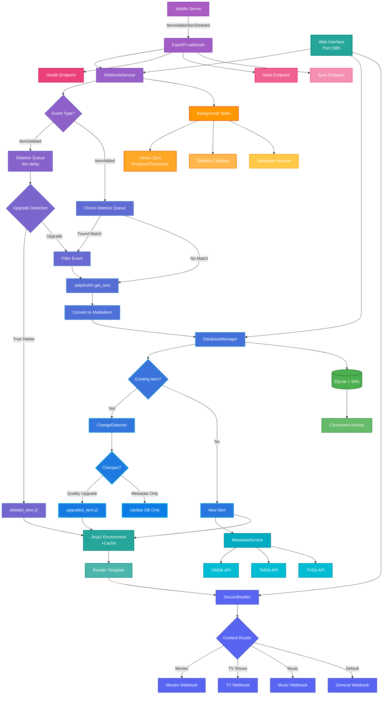

# Jellynouncer

<div align="center">
  
  
  <p align="center">
    <strong>🔔 Intelligent Discord Notifications for Jellyfin Media Server</strong>
  </p>
  
  <p align="center">
    Advanced webhook service with quality upgrade detection, multi-channel routing, and rich customization
  </p>
</div>

<div align="center">

[](https://opensource.org/licenses/MIT)
[](https://www.python.org/downloads/)
[](https://react.dev/)
[](https://hub.docker.com/r/markusmcnugen/jellynouncer)
[](https://github.com/MarkusMcNugen/Jellynouncer/issues)
[](https://github.com/MarkusMcNugen/Jellynouncer/stargazers)
[](https://github.com/MarkusMcNugen/Jellynouncer/releases)

</div>

---

## 📖 Overview

**Jellynouncer** is an advanced intermediary webhook service that bridges Jellyfin media server with Discord, providing intelligent notifications for media library changes. It goes beyond simple "new item" alerts by detecting quality upgrades, managing multi-channel routing, and offering extensive customization through Jinja2 templates.

The service acts as a smart filter between Jellyfin's webhook events and Discord notifications, analyzing changes to determine what's truly noteworthy - distinguishing between new content additions and quality improvements like resolution upgrades (1080p → 4K) or HDR additions.

## ✨ Key Features
### 🧠 Smart Change Detection

<details>
<summary><b>Intelligent Media Analysis</b></summary>

- **Intelligent Analysis**: Distinguishes between new content and quality upgrades
- **Technical Detection**: Identifies resolution improvements, codec upgrades (H.264 → H.265), audio enhancements (Stereo → 7.1), and HDR additions
- **Content Hashing**: Uses fingerprinting to prevent duplicate notifications while catching meaningful changes
- **Customizable Triggers**: Configure which changes warrant notifications
- **Rename Filtering**: Automatically detects and filters out file renames (same content, different path)
- **Upgrade Detection**: Intelligently handles file upgrades by filtering deletion notifications when followed by additions

</details>

### 🚀 Multi-Channel Discord Routing

<details>
<summary><b>Advanced Notification Management</b></summary>

- **Content-Type Routing**: Automatically routes movies, TV shows, and music to different Discord channels
- **Flexible Webhooks**: Support for unlimited custom webhooks with granular control
- **Smart Fallback**: Ensures no notifications are lost with configurable fallback webhooks
- **Grouping Options**: Batch notifications by event type or content type
- **Rate Limiting**: Respects Discord's API limits with intelligent queueing

</details>

### 🎨 Advanced Template System

<details>
<summary><b>Customizable Discord Embeds</b></summary>

- **Jinja2 Templates**: Fully customizable Discord embed messages
- **Rich Media Information**: Display posters, technical specs, ratings, cast, and plot summaries
- **Multiple Templates**: Different templates for new items, upgrades, and grouped notifications
- **Dynamic Content**: Templates can access all media metadata and technical information
- **Web Editor**: Edit templates directly in the web interface with syntax highlighting

</details>

### 📊 External Metadata Integration

<details>
<summary><b>Enhanced Media Information</b></summary>

- **Rating Services**: Integrates with OMDb, TMDb, and TVDB for ratings and additional metadata
- **Poster Management**: Automatic thumbnail generation and caching for Discord embeds
- **Fallback Handling**: Gracefully handles API failures without breaking notifications
- **Metadata Caching**: Reduces API calls with intelligent caching

</details>

### ⚡ Production-Ready Features

<details>
<summary><b>Enterprise-Grade Reliability</b></summary>

- **Database Persistence**: SQLite with WAL mode for concurrent access and change tracking
- **Intelligent Queue System**: Never lose notifications with automatic queueing during rate limits
  - Handles up to 500 queued notifications for large library updates
  - Automatic retry with exponential backoff (3 attempts)
  - Graceful processing during Discord rate limits (30/minute)
- **Background Sync**: Periodic library synchronization to catch missed webhooks
- **Health Monitoring**: Built-in health checks and diagnostic endpoints
- **Structured Logging**: Comprehensive logging with rotation and multiple output levels

</details>

### 🔧 DevOps Friendly

<details>
<summary><b>Easy Deployment & Management</b></summary>

- **Docker-First Design**: Optimized container with multi-stage builds
- **Environment Overrides**: All settings configurable via environment variables
- **Configuration Validation**: Automatic validation with detailed error reporting
- **Graceful Shutdown**: Proper cleanup and queue processing on shutdown
- **Web Management**: Full control through web interface on port 1985
- **Health Checks**: Docker-compatible health endpoints

</details>

## 🚀 Quick Start

### Prerequisites

- **Jellyfin Server** 10.8+ with [Webhook Plugin](https://github.com/jellyfin/jellyfin-plugin-webhook) installed
- **Discord Server** with webhook creation permissions
- **Docker** (recommended) or Python 3.13+ for manual installation

### Docker Compose (Recommended)

<details>
<summary><b>📦 View Docker Compose Setup</b></summary>

1. **Create directory structure:**
```bash
mkdir jellynouncer && cd jellynouncer
mkdir config data logs templates
```

2. **Create `docker-compose.yml`:**
```yaml
version: '3.8'

services:
  jellynouncer:
    image: markusmcnugen/jellynouncer:latest
    container_name: jellynouncer
    restart: unless-stopped
    ports:
      - "1984:1984"  # Webhook service
    environment:
      # Required
      - JELLYFIN_SERVER_URL=http://your-jellyfin-server:8096
      - JELLYFIN_API_KEY=your_api_key_here
      - JELLYFIN_USER_ID=your_user_id_here
      - DISCORD_WEBHOOK_URL=https://discord.com/api/webhooks/your/webhook
      
      # Optional: Content-specific webhooks
      - DISCORD_WEBHOOK_URL_MOVIES=https://discord.com/api/webhooks/movies
      - DISCORD_WEBHOOK_URL_TV=https://discord.com/api/webhooks/tv
      - DISCORD_WEBHOOK_URL_MUSIC=https://discord.com/api/webhooks/music
      
      # Optional: External APIs for enhanced metadata
      - OMDB_API_KEY=your_omdb_key
      - TMDB_API_KEY=your_tmdb_key
      - TVDB_API_KEY=your_tvdb_key
      
      # Optional: Web interface security
      - JWT_SECRET_KEY=your-secret-key-here  # Auto-generated if not set
      
      # System
      - PUID=1000
      - PGID=1000
      - TZ=Europe/Paris
      - LOG_LEVEL=INFO
      - JELLYNOUNCER_RUN_MODE=all  # all, webhook, or web
    volumes:
      - ./config:/app/config
      - ./data:/app/data
      - ./logs:/app/logs
      - ./templates:/app/templates
      # Optional: Custom web assets
      # - ./web/public:/app/web/dist/assets:ro
    healthcheck:
      test: ["CMD", "curl", "-f", "http://localhost:1984/health"]
      interval: 300s
      timeout: 10s
      retries: 3
      start_period: 10s
```

3. **Start the service:**
```bash
docker-compose up -d
```

4. **Access the services:**
   - Webhook Endpoint: `http://your-server:1984/webhook`

5. **Configure Jellyfin Webhook Plugin:**
   - Go to Jellyfin Dashboard → Plugins → Webhook
   - Add new webhook with URL: `http://your-server:1984/webhook`
   - Enable "Item Added" event
   - Enable "Item Deleted" event (optional, for deletion notifications)
   - Check "Send All Properties"
   - Save configuration

</details>

### Docker Run

<details>
<summary><b>🐳 View Docker Run Command</b></summary>

```bash
docker run -d \
  --name jellynouncer \
  --restart unless-stopped \
  -p 1984:1984 \
  -p 1985:1985 \
  -p 9000:9000 \
  -e JELLYFIN_SERVER_URL=http://jellyfin:8096 \
  -e JELLYFIN_API_KEY=your_api_key \
  -e JELLYFIN_USER_ID=your_user_id \
  -e DISCORD_WEBHOOK_URL=https://discord.com/api/webhooks/... \
  -v ./config:/app/config \
  -v ./data:/app/data \
  -v ./logs:/app/logs \
  -v ./templates:/app/templates \
  markusmcnugen/jellynouncer:latest
```

</details>

<summary><b>📋 View config.json Example</b></summary>

```json
{
  "jellyfin": {
    "server_url": "http://jellyfin:8096",
    "api_key": "your_key",
    "user_id": "your_id"
  },
  "discord": {
    "webhooks": {
      "movies": {
        "url": "https://discord.com/api/webhooks/...",
        "enabled": true,
        "grouping": {
          "mode": "both",
          "delay_minutes": 5,
          "max_items": 20
        }
      }
    },
    "routing": {
      "enabled": true,
      "fallback_webhook": "default"
    }
  },
  "notifications": {
    "watch_changes": {
      "resolution": true,
      "codec": true,
      "audio_codec": true,
      "hdr_status": true
    },
    "filter_renames": true,
    "filter_deletes": true
  }
}
```

</details>

**📚 [Complete Configuration Guide →](config/Readme.md)**

## 🔄 How It Works

### Architecture Overview



## 📡 API Endpoints

### Webhook Service (Port 1984)

| Endpoint | Method | Description |
|----------|--------|-------------|
| `/webhook` | POST | Main webhook receiver from Jellyfin |
| `/health` | GET | Service health and status |
| `/stats` | GET | Comprehensive statistics |
| `/sync` | POST | Trigger manual library synchronization |
| `/validate-templates` | GET | Validate all templates with sample data |
| `/test-webhook` | POST | Send test notification |


## 🎨 Templates

Jellynouncer uses Jinja2 templates for complete control over Discord embed formatting. Templates can be edited through the web interface or by modifying files directly.

### Template Types

| Type | Description | Files |
|------|-------------|-------|
| **Individual** | Single item notifications | `new_item.j2`, `upgraded_item.j2`, `deleted_item.j2` |
| **Grouped by Event** | Group by notification type | `new_items_by_event.j2`, `upgraded_items_by_event.j2` |
| **Grouped by Type** | Group by content type | `new_items_by_type.j2`, `upgraded_items_by_type.j2` |
| **Fully Grouped** | Combined grouping | `new_items_grouped.j2`, `upgraded_items_grouped.j2` |

**📚 [Complete Template Guide →](templates/Readme.md)**

## 🔧 Manual Installation

<details>
<summary><b>🛠️ View Manual Installation Steps</b></summary>

### Requirements
- Python 3.13+
- SQLite 3
- Git
- Node.js 20+ (for building web interface)

### Installation Steps

1. **Clone repository:**
```bash
git clone https://github.com/MarkusMcNugen/Jellynouncer.git
cd Jellynouncer
```

2. **Create virtual environment:**
```bash
python -m venv venv
source venv/bin/activate  # Windows: venv\Scripts\activate
```

3. **Install Python dependencies:**
```bash
pip install -r requirements.txt
```

4. **Build web interface:**
```bash
cd web
npm install
npm run build
cd ..
```

5. **Configure:**
```bash
cp config/config.json.example config/config.json
# Edit config.json with your settings
```

6. **Run:**
```bash
python main.py
```

7. **Access services:**
   - Webhook: `http://localhost:1984`

### Systemd Service (Linux)

Create `/etc/systemd/system/jellynouncer.service`:

```ini
[Unit]
Description=Jellynouncer Discord Webhook Service
After=network.target

[Service]
Type=simple
User=jellynouncer
WorkingDirectory=/opt/jellynouncer
Environment="PATH=/opt/jellynouncer/venv/bin"
ExecStart=/opt/jellynouncer/venv/bin/python main.py
Restart=always

[Install]
WantedBy=multi-user.target
```

Enable and start:
```bash
sudo systemctl enable jellynouncer
sudo systemctl start jellynouncer
```

</details>

## 🛠️ Troubleshooting

### Common Issues

<details>
<summary><b>❓ No notifications received</b></summary>

- Verify Jellyfin webhook plugin is configured correctly
- Check webhook URL points to `http://your-server:1984/webhook`
- Confirm Discord webhook URLs are valid
- Review logs in web interface or at `logs/jellynouncer.log`
- Use the test webhook feature in the web interface

</details>

<details>
<summary><b>❓ Database errors</b></summary>

```bash
# Check permissions
ls -la data/

# Reset database (loses history)
rm data/jellynouncer.db
docker restart jellynouncer
```

</details>

<details>
<summary><b>❓ Rate limiting issues</b></summary>

- Reduce `max_items` in grouping configuration
- Increase `delay_minutes` for batching
- Check Discord rate limits in logs
- Monitor queue status in web interface dashboard

</details>


### Debug Mode

Enable comprehensive debug logging to troubleshoot issues:

```yaml
# Docker Compose
environment:
  - LOG_LEVEL=DEBUG
```

```bash
# Manual
export LOG_LEVEL=DEBUG
python main.py
```

When `LOG_LEVEL=DEBUG`, the service will log:
- Complete HTTP request headers (with sensitive values masked)
- Raw request body content
- JSON structure and field analysis
- Webhook payload validation details
- Item deletion queue status
- Metadata API responses
- Discord notification attempts and results

### Log Locations

| Location | Description |
|----------|-------------|
| `logs/jellynouncer.log` | Main application log |
| `logs/jellynouncer-debug.log` | Debug log (when DEBUG enabled) |
| `docker logs jellynouncer` | Container logs |
| `http://your-server:1985` → Logs tab | Web interface log viewer |

## 📚 Documentation

| Document | Description |
|----------|-------------|
| [Configuration Guide](config/Readme.md) | Complete configuration reference |
| [Template Guide](templates/Readme.md) | Template customization and examples |
| [Web Interface Guide](docs/WebInterface.md) | Detailed web interface documentation |
| [API Reference](docs/API.md) | Complete API endpoint documentation |

## 🤝 Contributing

Contributions are welcome! Please feel free to submit a Pull Request.

### Development Setup

1. Fork the repository
2. Create your feature branch (`git checkout -b feature/AmazingFeature`)
3. Commit your changes (`git commit -m 'Add some AmazingFeature'`)
4. Push to the branch (`git push origin feature/AmazingFeature`)
5. Open a Pull Request

### Code Style

- Python 3.13+ with type hints
- PEP 8 compliance (Black formatter, 88 char limit)
- Google-style docstrings
- Comprehensive error handling
- React 19 with TypeScript for web interface
- Tailwind CSS for styling

### Tech Stack

| Layer | Technology |
|-------|------------|
| **Backend** | Python 3.13, FastAPI, SQLite, Pydantic v2 |
| **Frontend** | React 19, Vite 6, Tailwind CSS |
| **Tools** | Docker, ESLint 9, Prettier |
| **Testing** | Pytest, React Testing Library |

## 📄 License

This project is licensed under the MIT License - see the [LICENSE](LICENSE) file for details.

## 🙏 Acknowledgments

- [Jellyfin](https://jellyfin.org/) for the amazing media server
- [Discord](https://discord.com/) for the webhook API
- [FastAPI](https://fastapi.tiangolo.com/) for the modern Python web framework
- [React](https://react.dev/) and [Vite](https://vitejs.dev/) for the web interface
- All contributors and users of this project

## 💬 Support

- **Issues**: [GitHub Issues](https://github.com/MarkusMcNugen/Jellynouncer/issues)
- **Discussions**: [GitHub Discussions](https://github.com/MarkusMcNugen/Jellynouncer/discussions)
- **Wiki**: [GitHub Wiki](https://github.com/MarkusMcNugen/Jellynouncer/wiki)

---

<div align="center">
  <p>
    <strong>Made with ☕ by Mark Newton</strong>
  </p>
  <p>
    <i>If you find this project useful, please consider giving it a ⭐ on GitHub!</i>
  </p>
</div>